# SwiftCharts

[](http://cocoadocs.org/docsets/Charts)
[](https://github.com/Carthage/Carthage)
[](http://cocoadocs.org/docsets/Charts)

Easy to use and highly customizable charts library for iOS

##### Features:
- Bars - plain, stacked, grouped, horizontal, vertical
- Scatter
- Line / Multiple lines
- Areas
- Bubble
- Multiple axis
- Multiple labels (x axis)
- Candlestick
- Cubic line
- Everything is customizable - views (user can generate arbitrary UIViews for each chartpoint, so everything is possible), animations, units, axis, etc.
- Charts can be combined with each other (e.g. lines + bars + circles)
- Complex interactivity support
- Choice to use core graphics (directly on chart's context) or UIViews, or combine both.
- **Easy to use**: no learning curve, no complicated settings - just assemble chart using well defined components.

Swift 1.2, Swift 2.0, iOS 7, 8, 9

[Video](https://www.youtube.com/watch?v=bD6uDF-KckM)

##### Screenshots:

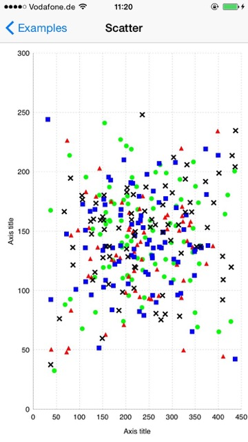
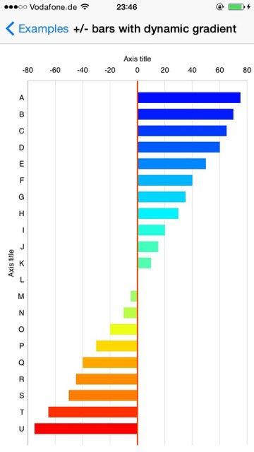
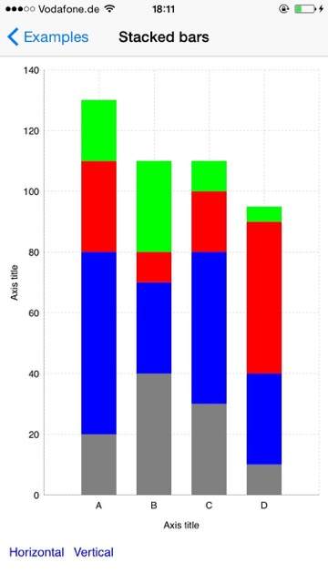
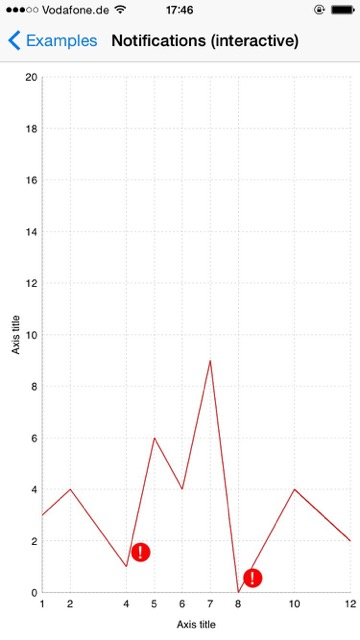
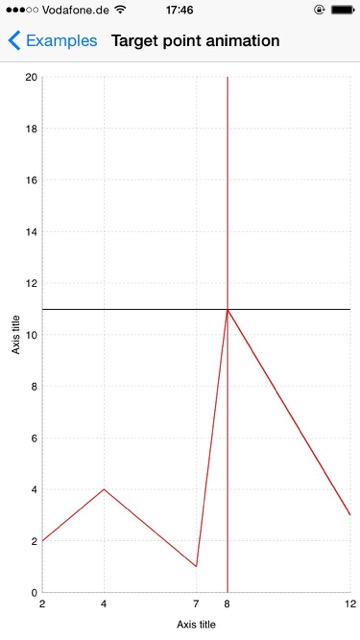
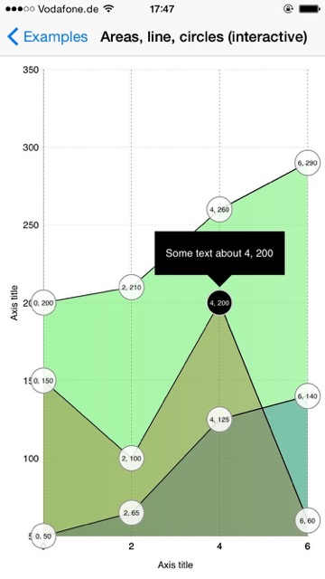
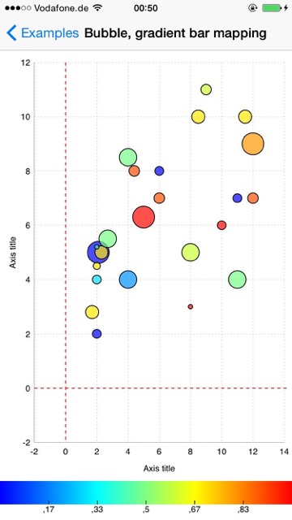
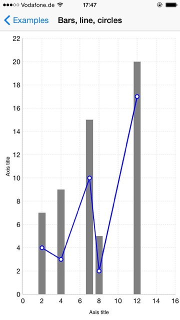
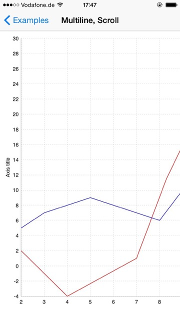
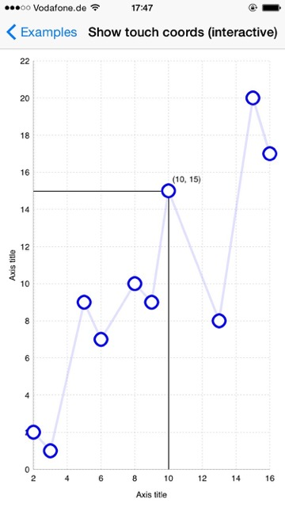
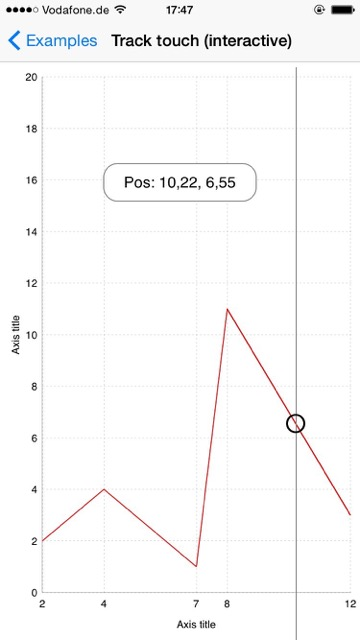
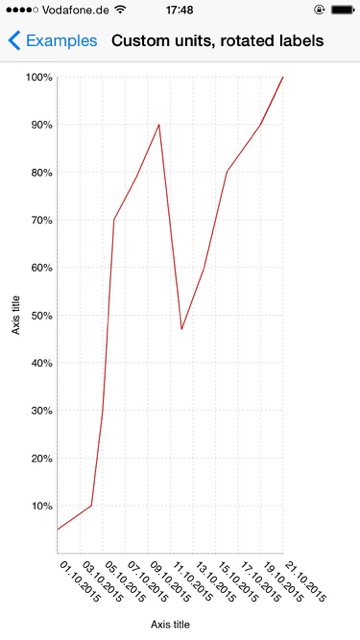
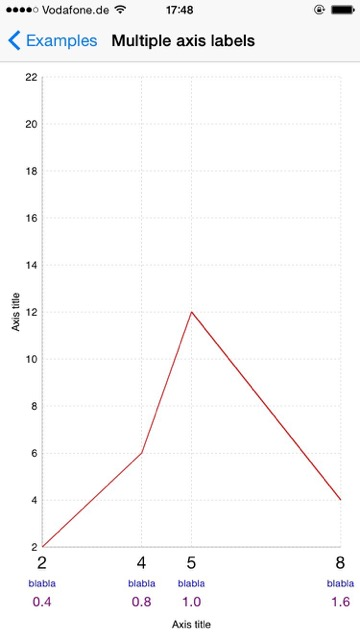
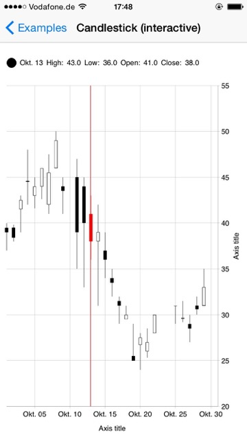
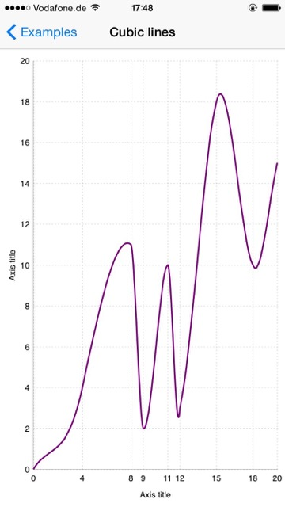
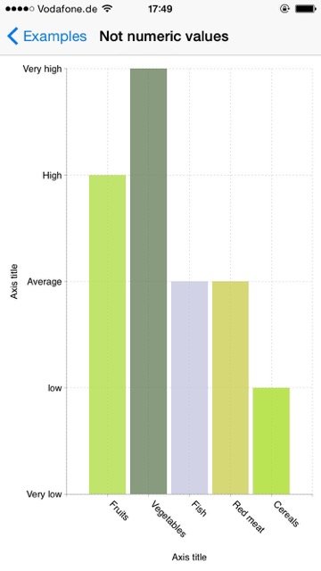
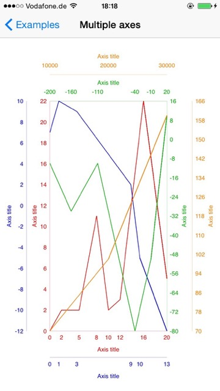
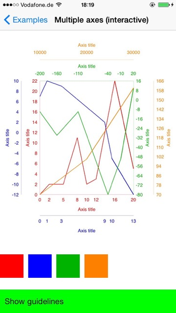


##### Installation

##### CocoaPods

Add to your Podfile:

Swift 2.x:
```ruby
use_frameworks!
pod 'SwiftCharts', '~> 0.3'
```

Swift 1.2 (not actively mantained anymore):
```ruby
use_frameworks!
pod 'SwiftCharts', :git => 'https://github.com/i-schuetz/SwiftCharts.git', :branch => 'swift1.2'
```
Or use the 0.2 tag:
```ruby
use_frameworks!
pod 'SwiftCharts', '~> 0.2'
```

And then:
```ruby
pod install
```

Import the framework in your code:
```swift
import SwiftCharts
```

##### Carthage

Add to your Cartfile:

Swift 2.x:
```
github "i-schuetz/SwiftCharts" ~> 0.3
```

Swift 1.2:
```
github "i-schuetz/SwiftCharts" ~> 0.2
```

##### Quick start 

Multiline chart:

```swift
let chartConfig = ChartConfigXY(
    xAxisConfig: ChartAxisConfig(from: 2, to: 14, by: 2),
    yAxisConfig: ChartAxisConfig(from: 0, to: 14, by: 2)
)

let chart = LineChart(
    frame: CGRectMake(0, 70, 300, 500),
    chartConfig: chartConfig,
    xTitle: "X axis",
    yTitle: "Y axis",
    lines: [
        (chartPoints: [(2.0, 10.6), (4.2, 5.1), (7.3, 3.0), (8.1, 5.5), (14.0, 8.0)], color: UIColor.redColor()),
        (chartPoints: [(2.0, 2.6), (4.2, 4.1), (7.3, 1.0), (8.1, 11.5), (14.0, 3.0)], color: UIColor.blueColor())
    ]
)

self.view.addSubview(chart.view)
```

Bars chart:

```swift
let chartConfig = BarsChartConfig(
    valsAxisConfig: ChartAxisConfig(from: 0, to: 8, by: 2)
)

let chart = BarsChart(
    frame: CGRectMake(0, 70, 300, 500),
    chartConfig: chartConfig,
    xTitle: "X axis",
    yTitle: "Y axis",
    bars: [
        ("A", 2),
        ("B", 4.5),
        ("C", 3),
        ("D", 5.4),
        ("E", 6.8),
        ("F", 0.5)
    ],
    color: UIColor.redColor(),
    barWidth: 20
)

self.view.addSubview(chart.view)
self.chart = chart
```


##### Concept:

- Layer architecture, which makes it extremely easy to customize charts, create new types, combine existing ones and add interactive elements.

- Creation of views via a generator function, which makes it easy to use custom views in any layer.

##### Main Components:

##### 1. Layers:

A chart is the result of composing layers together. Everything is a layer - axis, guidelines, dividers, line, circles, etc. The idea is to have losely coupled components that can be easily changed and combined. This is for example the structure of a basic chart, which shows a line with circles:

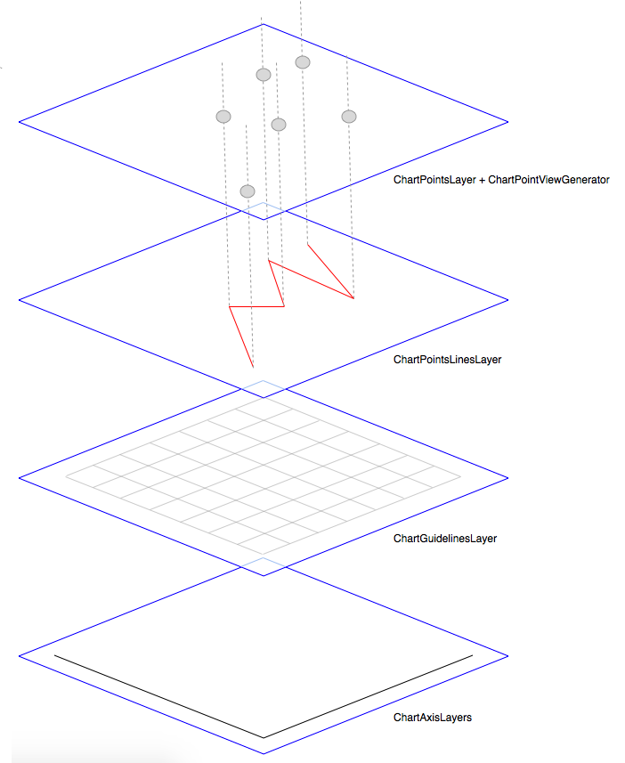


Following a more low level example, to provide an insight into the layer system. Note that most examples are written like this, in order to provider maximal flexibility.

```swift
let labelSettings = ChartLabelSettings(font: ExamplesDefaults.labelFont)

let chartPoints = [(2, 2), (3, 1), (5, 9), (6, 7), (8, 10), (9, 9), (10, 15), (13, 8), (15, 20), (16, 17)].map{ChartPoint(x: ChartAxisValueInt($0.0), y: ChartAxisValueInt($0.1))}

let xValues = Array(stride(from: 2, through: 16, by: 2)).map {ChartAxisValueInt($0, labelSettings: labelSettings)}
let yValues = Array(stride(from: 0, through: 20, by: 2)).map {ChartAxisValueInt($0, labelSettings: labelSettings)}

let xModel = ChartAxisModel(axisValues: xValues, axisTitleLabel: ChartAxisLabel(text: "Axis title", settings: labelSettings))
let yModel = ChartAxisModel(axisValues: yValues, axisTitleLabel: ChartAxisLabel(text: "Axis title", settings: labelSettings))
let chartFrame = ExamplesDefaults.chartFrame(self.view.bounds)

let chartSettings = ExamplesDefaults.chartSettings
let coordsSpace = ChartCoordsSpaceLeftBottomSingleAxis(chartSettings: chartSettings, chartFrame: chartFrame, xModel: xModel, yModel: yModel)
let (xAxis, yAxis, innerFrame) = (coordsSpace.xAxis, coordsSpace.yAxis, coordsSpace.chartInnerFrame)

// create layer with line
let lineModel = ChartLineModel(chartPoints: chartPoints, lineColor: UIColor(red: 0.4, green: 0.4, blue: 1, alpha: 0.2), lineWidth: 3, animDuration: 0.7, animDelay: 0)
let chartPointsLineLayer = ChartPointsLineLayer(xAxis: xAxis, yAxis: yAxis, innerFrame: innerFrame, lineModels: [lineModel])

// view generator - creates circle view for each chartpoint
let circleViewGenerator = {(chartPointModel: ChartPointLayerModel, layer: ChartPointsLayer, chart: Chart) -> UIView? in
    return ChartPointCircleView(center: chartPointModel.screenLoc, size: CGSizeMake(20, 20), settings: ChartPointCircleViewSettings(animDuration: 0.5))
}
// create layer that uses the view generator
let chartPointsCircleLayer = ChartPointsViewsLayer(xAxis: xAxis, yAxis: yAxis, innerFrame: innerFrame, chartPoints: chartPoints, viewGenerator: circleViewGenerator, displayDelay: 0, delayBetweenItems: 0.05)

// create layer with guidelines
var settings = ChartGuideLinesDottedLayerSettings(linesColor: UIColor.blackColor(), linesWidth: ExamplesDefaults.guidelinesWidth, axis: .XAndY)
let guidelinesLayer = ChartGuideLinesDottedLayer(xAxis: xAxis, yAxis: yAxis, innerFrame: innerFrame, settings: settings)

let chart = Chart(
    frame: chartFrame,
    layers: [
        xAxis,
        yAxis,
        guidelinesLayer,
        chartPointsLineLayer,
        chartPointsCircleLayer
    ]
)

self.view.addSubview(chart.view)
self.chart = chart
```

Layers are semantic units that can add views to the chart, or can simply draw in the chart's context for a better performance. Which makes more sense depends on the requirements.

##### 2. View generators:

View based layers will use a generator function to generate chart point views. This function receives the complete state of each chartpoint (model data, screen location) and produces an UIView, allowing any type of customization.

##### Hello world:

There's a [hello world](Examples/Examples/HelloWorld.swift) included in the examples, similar to the above code, with a bit more explanations. Change some properties of the generated views, copy paste the chartPointsLineLayer used in the snippet above, and pass it to the chart's layers, to display a line behind the views, and you have already mastered the main concepts!

##### Note on performance:

If you have a lot of axis labels in your chart it may be necessary to do the calculation of the coordinate space in the background, to avoid possible delays which are noticeable during transitions or scrolling. See ScrollExample or MultipleAxesExample example for this.


###### [More documentation coming soon!](https://github.com/i-schuetz/SwiftCharts/wiki/Wiki)


##### Contributing

1. Fork
2. Commit changes to a branch in your fork
3. Push your code and make a pull request

##### Created By:

Ivan Schütz

##### License

SwiftCharts is Copyright (c) 2015 Ivan Schütz and released as open source under the attached [Apache 2.0 license](LICENSE).

THE SOFTWARE IS PROVIDED "AS IS", WITHOUT WARRANTY OF ANY KIND,
EXPRESS OR IMPLIED, INCLUDING BUT NOT LIMITED TO THE WARRANTIES OF
MERCHANTABILITY, FITNESS FOR A PARTICULAR PURPOSE AND NONINFRINGEMENT.
IN NO EVENT SHALL THE AUTHORS BE LIABLE FOR ANY CLAIM, DAMAGES OR
OTHER LIABILITY, WHETHER IN AN ACTION OF CONTRACT, TORT OR OTHERWISE,
ARISING FROM, OUT OF OR IN CONNECTION WITH THE SOFTWARE OR THE USE OR
OTHER DEALINGS IN THE SOFTWARE.

This is a port to Swift and (massively improved) continuation of an obj-c project which I did while working at eGym GmbH https://github.com/egymgmbh/ios-charts
