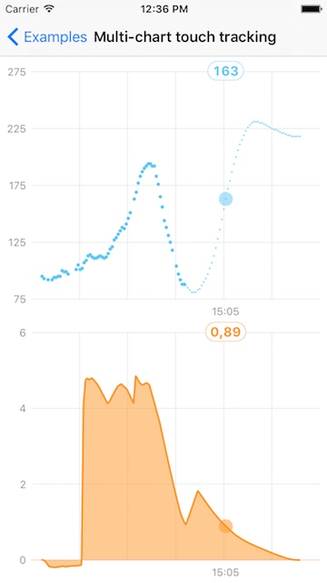
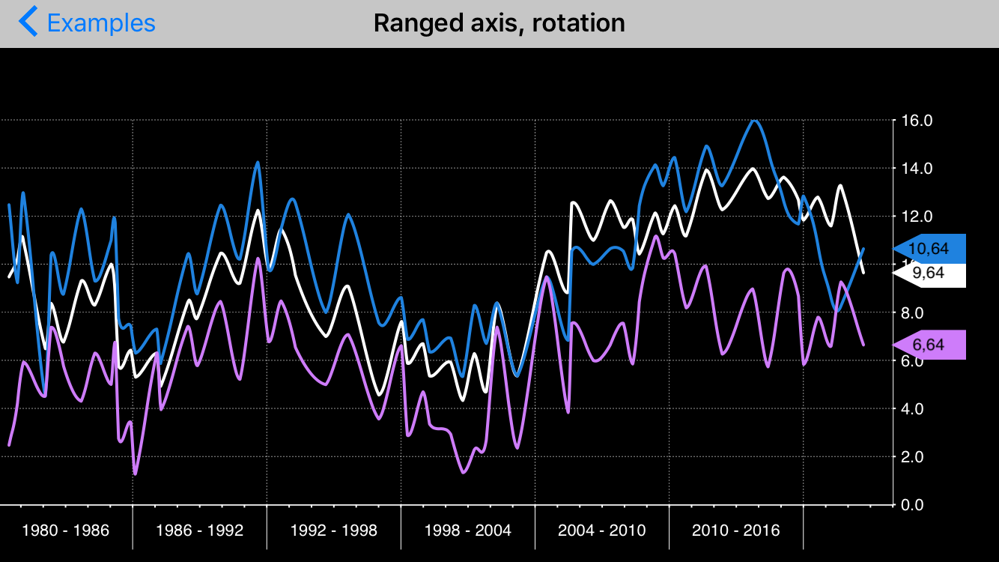
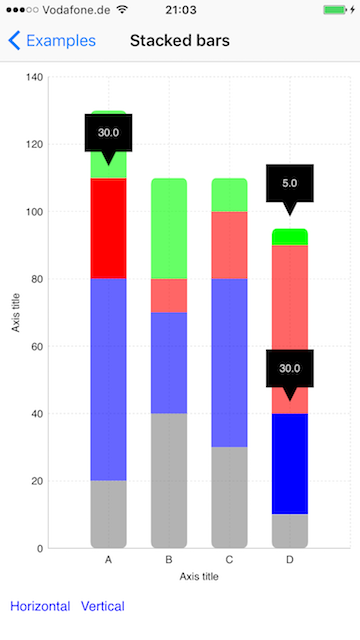
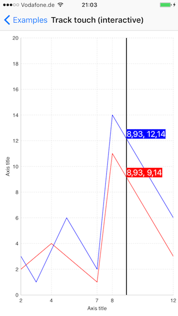

# SwiftCharts

[](http://cocoadocs.org/docsets/SwiftCharts)
[](https://github.com/Carthage/Carthage)
[](http://cocoadocs.org/docsets/SwiftCharts)

Easy to use and highly customizable charts library for iOS

## Features:
- Bars - plain, stacked, grouped, horizontal, vertical
- Scatter
- Lines (straight/cubic/custom path generator)
- Areas
- Bubble
- Multiple axes
- Candlestick
- Multiple labels per value (x axis)
- Everything is customizable - colors, views, units, labels, animations, interactions, axes, etc.
- Easy creation of arbitrary markers, overlays, info views, etc., using simple UIViews!
- Modular architecture, which allows to easily create new chart types or add effects to existing types externally (without library changes).
- Charts can be combined with each other.
- [Pie chart*](https://github.com/i-schuetz/PieCharts)
- [Legends*](https://github.com/i-schuetz/ChartLegends)
- Zooming & panning, lockable to x/y axis, max delta or both. Elastic effect. (unreleased)
- Extensible axis values and label generators for numbers, dates, etc, with customizable zooming handling (nice numbers, divide in half, etc). (unreleased).

<sub>*These are separate repos for better focus and reusability.</sub>

Swift 3.0, 2.x, 1.2, iOS 10, 9, 8, 7

[Video](https://www.youtube.com/watch?v=bD6uDF-KckM)












## Installation

### CocoaPods

Add to your Podfile:

Swift 3.x:
```ruby
use_frameworks!
pod 'SwiftCharts', '~> 0.6'
```
Note: To use Swift 3.x / master, you need Xcode 8+

To use master directly:
```ruby
pod 'SwiftCharts', :git => 'https://github.com/i-schuetz/SwiftCharts.git'
```

Swift 2.3 (not actively maintained):
```ruby
use_frameworks!
pod 'SwiftCharts', '~> 0.4'
```

And then:
```ruby
pod install
```

Import the framework in your code:
```swift
import SwiftCharts
```

### Carthage

Add to your Cartfile:

Swift 3.x:
```
github "i-schuetz/SwiftCharts" ~> 0.6
```

Swift 2.3 (not actively maintained):
```
github "i-schuetz/SwiftCharts" ~> 0.4
```
## Migration guide 0.5.x - 0.6

- Inner frame is now passed only to `Chart` instead of to the layers.
- `ChartSettings` now have to be passed to `Chart`.
- `ChartAxisLayer` now doesn't directly manage the logic to map between screen and domain coordinates, but delegates this to a new `ChartAxis` class. `ChartAxis` is what has to be passed now to the chart layers. Shortly, pass to the layers `axisLayer.axis` instead of `axisLayer`.

If I'm forgetting something, please add it or open an issue!

The best way to migrate is probably to compare an example from 0.5.1 and 0.6. For the newly added zooming and panning you may need some work to get everything working correctly, depending on the kind of functionality you use. Here also please look at the examples.

Please also take a look at the [changelog](https://github.com/i-schuetz/SwiftCharts/blob/master/CHANGELOG.md) for newly added functionality and features.

## Quick start 

Multiline chart:

```swift
let chartConfig = ChartConfigXY(
    xAxisConfig: ChartAxisConfig(from: 2, to: 14, by: 2),
    yAxisConfig: ChartAxisConfig(from: 0, to: 14, by: 2)
)

let frame = CGRect(x: 0, y: 70, width: 300, height: 500)

let chart = LineChart(
    frame: frame,
    chartConfig: chartConfig,
    xTitle: "X axis",
    yTitle: "Y axis",
    lines: [
        (chartPoints: [(2.0, 10.6), (4.2, 5.1), (7.3, 3.0), (8.1, 5.5), (14.0, 8.0)], color: UIColor.red),
        (chartPoints: [(2.0, 2.6), (4.2, 4.1), (7.3, 1.0), (8.1, 11.5), (14.0, 3.0)], color: UIColor.blue)
    ]
)

self.view.addSubview(chart.view)
```

Bars chart:

```swift
let chartConfig = BarsChartConfig(
    valsAxisConfig: ChartAxisConfig(from: 0, to: 8, by: 2)
)

let frame = CGRect(x: 0, y: 70, width: 300, height: 500)
        
let chart = BarsChart(
    frame: frame,
    chartConfig: chartConfig,
    xTitle: "X axis",
    yTitle: "Y axis",
    bars: [
        ("A", 2),
        ("B", 4.5),
        ("C", 3),
        ("D", 5.4),
        ("E", 6.8),
        ("F", 0.5)
    ],
    color: UIColor.red,
    barWidth: 20
)

self.view.addSubview(chart.view)
self.chart = chart
```

## Concept:

- Layer architecture, which makes it extremely easy to customize charts, create new types, combine existing ones and add interactive elements.

- Creation of views via a generator function, which makes it easy to use custom views in any layer.

### Main Components:

#### 1. Layers:

A chart is the result of composing layers together. Everything is a layer - axis, guidelines, dividers, line, circles, etc. The idea is to have losely coupled components that can be easily changed and combined. This is for example the structure of a basic chart, which shows a line with circles:


Following a more low level example, to provide an insight into the layer system. Note that most examples are written like this, in order to provider maximal flexibility.

```swift

let chartPoints: [ChartPoint] = [(2, 2), (4, 4), (6, 6), (8, 10), (12, 14)].map{ChartPoint(x: ChartAxisValueInt($0.0), y: ChartAxisValueInt($0.1))}

let xValues = 0.stride(through: 16, by: 2).map {ChartAxisValueInt($0)}
let yValues = 0.stride(through: 16, by: 2).map {ChartAxisValueInt($0)}

let labelSettings = ChartLabelSettings(font: UIFont.systemFontOfSize(14))

// create axis models with axis values and axis title
let xModel = ChartAxisModel(axisValues: xValues, axisTitleLabel: ChartAxisLabel(text: "Axis title", settings: labelSettings))
let yModel = ChartAxisModel(axisValues: yValues, axisTitleLabel: ChartAxisLabel(text: "Axis title", settings: labelSettings.defaultVertical()))

let chartFrame = CGRectMake(20, 100, 300, 400)

let chartSettings = ChartSettings()
chartSettings.axisStrokeWidth = 0.2
chartSettings.top = 20
chartSettings.trailing = 20
// ...

let coordsSpace = ChartCoordsSpaceLeftBottomSingleAxis(chartSettings: chartSettings, chartFrame: chartFrame, xModel: xModel, yModel: yModel)
let (xAxis, yAxis, innerFrame) = (coordsSpace.xAxis, coordsSpace.yAxis, coordsSpace.chartInnerFrame)

// create layer with line
let lineModel = ChartLineModel(chartPoints: chartPoints, lineColor: UIColor(red: 0.4, green: 0.4, blue: 1, alpha: 0.2), lineWidth: 3, animDuration: 0.7, animDelay: 0)
let chartPointsLineLayer = ChartPointsLineLayer(xAxis: xAxis, yAxis: yAxis, innerFrame: innerFrame, lineModels: [lineModel])

// creates custom view for each chartpoint
let myCustomViewGenerator = {(chartPointModel: ChartPointLayerModel, layer: ChartPointsLayer, chart: Chart) -> UIView? in
    let center = chartPointModel.screenLoc
    let label = UILabel(frame: CGRectMake(center.x - 20, center.y - 10, 40, 20))
    label.backgroundColor = UIColor.greenColor()
    label.textAlignment = NSTextAlignment.Center
    label.text = chartPointModel.chartPoint.description
    label.font = ExamplesDefaults.labelFont
    return label
}

// create layer that uses the view generator
let myCustomViewLayer = ChartPointsViewsLayer(xAxis: xAxis, yAxis: yAxis, innerFrame: innerFrame, chartPoints: chartPoints, viewGenerator: myCustomViewGenerator, displayDelay: 0, delayBetweenItems: 0.05)


// create layer with guidelines
let settings = ChartGuideLinesDottedLayerSettings(linesColor: UIColor.blackColor(), linesWidth: ExamplesDefaults.guidelinesWidth)
let guidelinesLayer = ChartGuideLinesDottedLayer(xAxis: xAxis, yAxis: yAxis, innerFrame: innerFrame, settings: settings)

let chart = Chart(
    frame: chartFrame,
    layers: [
        xAxis,
        yAxis,
        guidelinesLayer,
        chartPointsLineLayer,
        myCustomViewLayer
    ]
)

self.view.addSubview(chart.view)
self.chart = chart
```

Layers decide how to present their data - this can be done adding subviews, (CA)layers, with core graphics, etc.

#### 2. View generators:

View based layers will use a generator function to generate chart point views. This function receives the complete state of each chartpoint (model data, screen location) and produces an UIView, allowing any type of customization.

### Hello world:

There's a [hello world](Examples/Examples/HelloWorld.swift) included in the examples, similar to the above code, with a bit more explanations. Change some properties of the generated views, copy paste the chartPointsLineLayer used in the snippet above, and pass it to the chart's layers, to display a line behind the views, and you have already mastered the main concepts!

#### Important!

* Don't forget to always keep a strong reference to the chart instance or it will be released, which leads to axis & labels not showing.

* If you have a lot of axis labels in your chart it may be necessary to do the calculation of the coordinate space in the background, to avoid possible delays which are noticeable during transitions or scrolling. See ScrollExample or MultipleAxesExample example for this.

###### [More documentation coming soon!](https://github.com/i-schuetz/SwiftCharts/wiki/Wiki)


## Contributing

1. Fork
2. Commit changes to a branch in your fork
3. Push your code and make a pull request

## Todos:

There are quite a lot of things that can be done, but here the main prios:

- Dynamic adding/removing of chart points.
- Lazy loading, EC.
- Allow to set initial content view size that exceeds the chart's boundaries without having to use zoom.
- macOS support.
- Improve documentation.
- Write a tutorial.
- Objective-C support? I have gotten out of touch with Obj-C and don't even remember what exactly has to be done to add compatibility. If it doesn't require any major structural changes, it's also welcome. 

If you want to help with any of these, feel free to open an issue to request for assistance. Happy to give an introduction to the internals and explain any parts of the library that may not be clear. It would be also possible to e.g. open a Slack channel for real time cooperation.

Nice to have also, a zooming & panning refactoring to use a global transformation matrix instead of the current separate axes / content view transforms. This is only to improve code quality. It may sound easy but due to some implementation details of SwiftCharts it is a bit complicated. More details [here](http://stackoverflow.com/questions/41337146/apply-transform-matrix-to-core-graphics-drawing-and-subview). 

## Created By:

Ivan Schütz

#### :fire: If you need something special or just help with your charts, you can [hire me!](http://www.ivanschuetz.com/contact-impressum.php)

## Credits:

A big thank you to the awesome [grafiti.io](https://grafiti.io/) for having been sponsoring this project in the last months, and of course also to all the [contributors](https://github.com/i-schuetz/SwiftCharts/graphs/contributors)! 

## License

SwiftCharts is Copyright (c) 2015 Ivan Schütz and released as open source under the attached [Apache 2.0 license](LICENSE).

THE SOFTWARE IS PROVIDED "AS IS", WITHOUT WARRANTY OF ANY KIND,
EXPRESS OR IMPLIED, INCLUDING BUT NOT LIMITED TO THE WARRANTIES OF
MERCHANTABILITY, FITNESS FOR A PARTICULAR PURPOSE AND NONINFRINGEMENT.
IN NO EVENT SHALL THE AUTHORS BE LIABLE FOR ANY CLAIM, DAMAGES OR
OTHER LIABILITY, WHETHER IN AN ACTION OF CONTRACT, TORT OR OTHERWISE,
ARISING FROM, OUT OF OR IN CONNECTION WITH THE SOFTWARE OR THE USE OR
OTHER DEALINGS IN THE SOFTWARE.

This is a port to Swift and (massively improved) continuation of an obj-c project which I did while working at eGym GmbH https://github.com/egymgmbh/ios-charts
